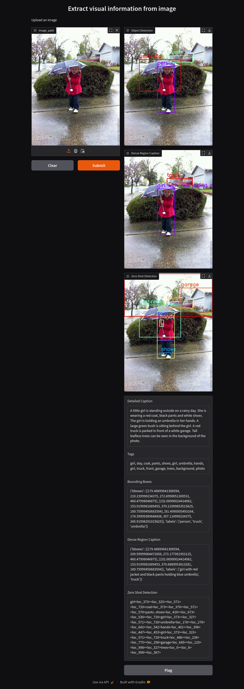
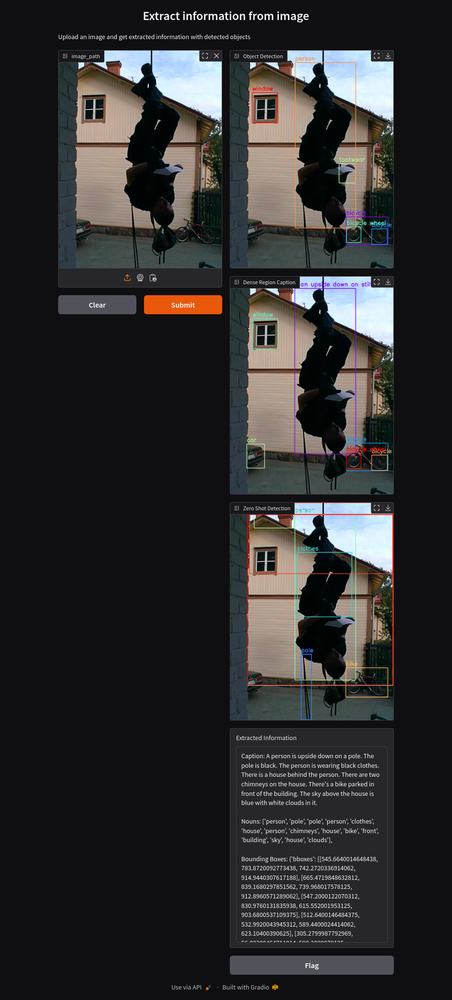

# vlm-parser
Extract visual information from your images using VLM.

Input an image and you get the following information extracted from the image:

1. Detailed image caption.
2. Bounding boxes of detected objects.
3. Captions of detected objects.
4. Bounding boxes of zero-shot detected objects.

## Installation
Install [`uv`](https://docs.astral.sh/uv/).

Next, create a virtual environment and install the dependencies.

```bash
uv venv
```

Activate the virtual environment.

```bash
source .venv/bin/activate
```

Then install the dependencies.

```bash
uv sync
```

Download the spacy English model.

```bash
python -m spacy download en_core_web_sm
```

## Usage
Run the Gradio app.

```bash
python scripts/app.py
```


## Results



